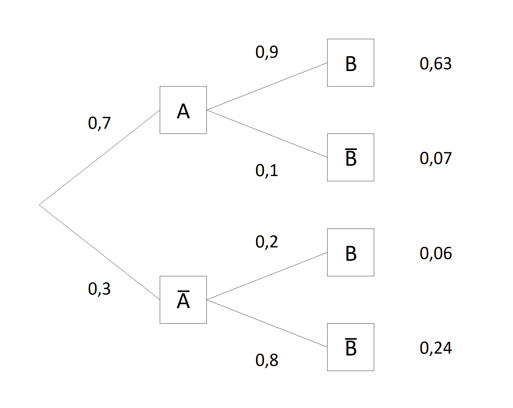
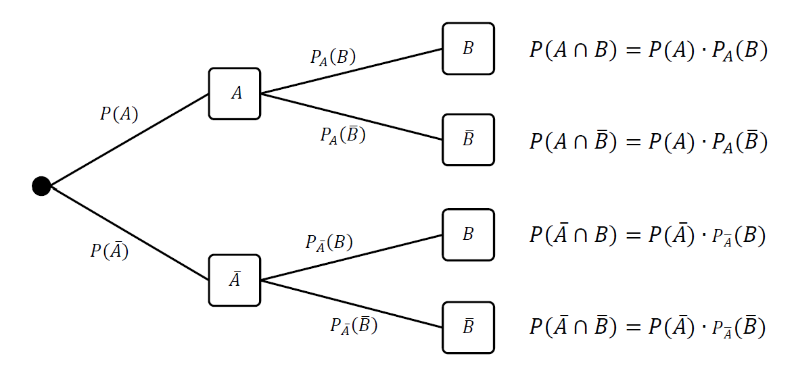
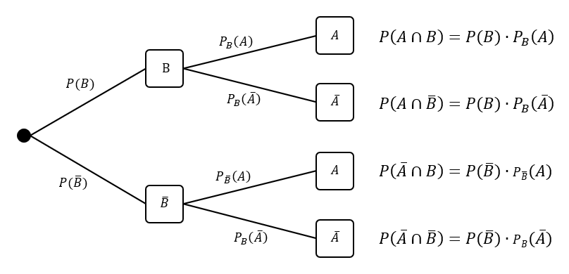
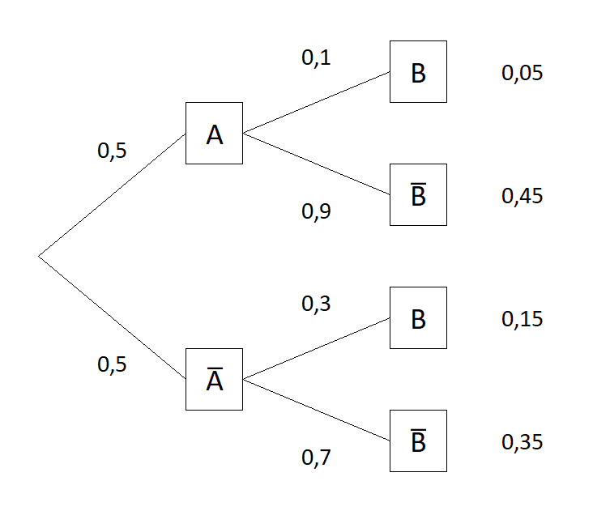
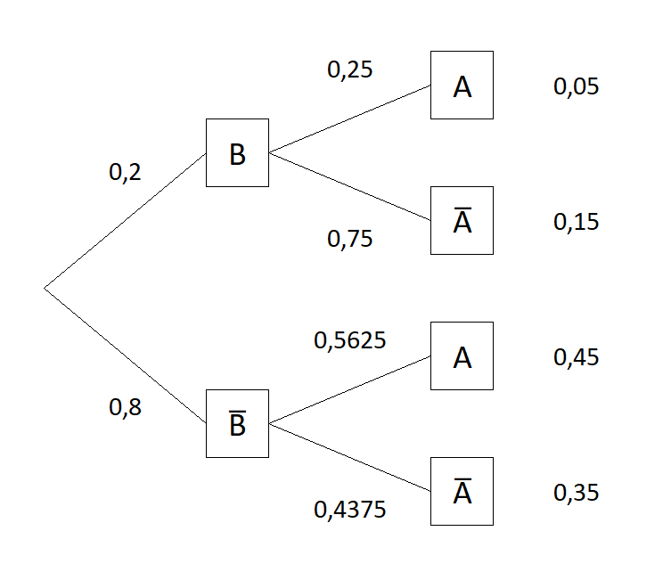
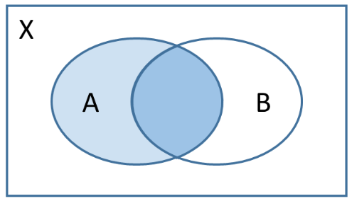
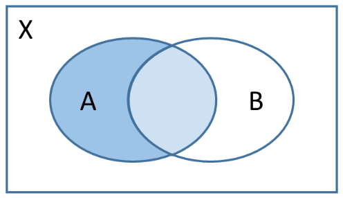

### Einführung

Wir betrachten ein mehrstufiges Zufallsexperiment mit den zwei Ereignissen
* $A$: Ein Schüler lernt für die Prüfung.
* $B$: Ein Schüler besteht die Prüfung.

Das Baumdiagramm habe die Gestalt
<figure>
  
</figure>

Hat ein Schüler gelernt, so besteht er mit einer Wahrscheinlichkeit von 90&nbsp;\% die Prüfung, hat er nicht gelernt, besteht er die Prüfung nur mit einer Wahrscheinlichkeit von 20&nbsp;\%. Die Wahrscheinlichkeit, dass ein Schüler die Prüfung besteht, hängt also davon ab, ob er gelernt hat. Mit anderen Worten: Die Wahrscheinlichkeit für $B$ (und auch für $\overline{B}$) hängt davon ab, ob $A$ eingetreten ist (oder nicht). Diese Wahrscheinlichkeiten der zweiten Stufe des Baumdiagramms heißen **bedingte Wahrscheinlichkeiten**, da für sie eine Bedingung $-$ hier $A$ oder $\overline{A}$ $-$ vorliegt.
Wir  verwenden die folgenden Bezeichnungen

<figure>
  
</figure>

Mit Hilfe der Pfadregeln folgt unmittelbar
$$
P_A(B)=\frac{P(A\cap B)}{P(A)}.
$$
Für $P_A(B)$ ist auch die Bezeichnung $P(B|A)$ üblich. Wir nennen $P_A(B)$ die **Wahrscheinlichkeit von $B$ unter der Bedingung $A$**. Entsprechend gilt die Formel für andere Konstellationen, z.B. $P_B(A)=\frac{P(A\cap B)}{P(B)}$ oder $P_{\overline{A}}(B)=\frac{P(\overline{A}\cap B)}{P(\overline{A})}$. 

Im Beispiel haben wir $P_A(B)=0{,}9$ und $P_{\overline{A}}(B)=0{,}2$. Die Wahrscheinlichkeit eine Prüfung zu bestehen ist also größer, wenn man gelernt hat.

Wichtig ist die Unterscheidung zwischen $P(A\cap B)$ und $P_A(B)$ :
* $P(A\cap B)$ bezeichnet die Wahrscheinlichkeit, dass ein Schüler die Prüfung besteht **und** gelernt hat.
* $P_A(B)$ bezeichnet die Wahrscheinlichkeit, dass ein Schüler die Prüfung besteht, **wenn** er gelernt hat.

### Das Ganze und der Teil
Bedingte Wahrscheinlichkeiten lassen sich auch mit Hilfe relativer Häufigkeiten beschreiben. Allgemein können Wahrscheinlichkeiten als relative Häufigkeiten oder Anteile interpretiert werden: 
$$
\text{Wahrscheinlichkeit} = \text{Anteil} =\frac{\text{Teil}}{\text{Ganze}}.
$$

Angenommen in unserem Beispiel haben 200 Schüler die Prüfung geschrieben. Dann haben
*  126 Schüler $-$ oder $\frac{126}{200}=63\\%$ $-$ gelernt und die Prüfung bestanden,
*  14 Schüler $-$ oder $\frac{14}{200}=7\\%$ $-$ gelernt und die nicht Prüfung bestanden,
*  12 Schüler $-$ oder $\frac{12}{200}=6\\%$ $-$ nicht gelernt und die Prüfung bestanden,
*  48 Schüler $-$ oder $\frac{48}{200}=24\\%$ $-$ nicht gelernt und die Prüfung nicht bestanden.

Für $P_A(B)$ betrachten wir nur die Schüler, die gelernt haben, das sind $126+14=140.$ Davon haben nun $126$ gelernt. Wir erhalten $P_A(B)=\frac{126}{140}=90\\%$.

Zusammengefasst:
* $P(A\cap B)$: Der Teil sind die Schüler, die die Prüfung bestanden und gelernt haben. Das Ganze sind **alle Schüler**.
* $P_A(B)$: Der Teil sind die Schüler, die die Prüfung bestanden und gelernt haben. Das Ganze sind **die Schüler, die gelernt haben**.

### Umrechnen bedingter Wahrscheinlichkeiten

#### Das inverse Baumdigramm
Es ist wichtig zu erwähnen, dass im Baumdigramm

<figure>
  
</figure>

die Wahrscheinlichkeiten $P_B(A)$, $P_B(\overline{A})$, $P_{\overline{B}}(A)$ und $P_{\overline{B}}({\overline{A}})$ **nicht** abgelesen werden können. Um diese bedingten Wahrscheinlichkeiten ablesen zu können, benötigen wir $B$ und $\overline{B}$ auf der ersten und $A$ und $\overline{A}$ auf der zweiten Stufe. Mit anderen Worten: $A$ und $B$ müssen vertauscht werden. Wenn wir dies tun, entsteht das sogenannte **inverse Baumdiagramm**:

<figure>
  
</figure>

#### Beispiel
Gegeben sei das Baumdigramm

<figure>
  
</figure>

Wir berechnen zunächst $P(B)=0{,}05+0{,}15=0{,}2$. Damit ist $P(\overline{B})=0{,}8$. Aus $P(A\cap B)=P(B)\cdot P_B(A)$ (1.&nbsp;Pfadendwahrscheinlichkeit des inversen Baumdiagramms) folgt dann $P_B(A)=0{,}05:0{,}2=0{,}25$. Analog berechnen wir die weiteren bedingten Wahrscheinlichkeiten. Schließlich erhalten wir für das inverse Baumdigramm

<figure>
  
</figure>

in dem nun die bedingten Wahrscheinlichkeiten mit $B$- und $\overline{B}$-Bedingung auftreten.

#### Der Satz von Bayes
Aus der Defintion der bedingten Wahrscheinlichkeit
$$
P_A(B)=\frac{P(A\cap B)}{P(A)}
$$
folgt $P(A\cap B)=P(A)\cdot P_A(B)$. Für die bedingte Wahrscheinlochkeit mit $A$ und $B$ vertauscht gilt dann
\begin{align*}
P_B(A)&=\frac{P(A\cap B)}{P(B)}\\\\
P_B(A)&=\frac{P(A)\cdot P_A(B)}{P(B)}.\\\\
\end{align*}
Mit letzterer Formel lassen sich bedingte Wahrscheinlichkeiten direkt umrechnen, sie wird auch **Satz von Bayes** genannt.

#### Beispiel
Im obigen Baumdiagramm gilt
\begin{align*}
P_B(A)&=\frac{P(A)\cdot P_A(B)}{P(B)}\\\\
      &=\frac{0{,}05\cdot 0{,}01}{0{,}2}\\\\
      &=0{,}25.
\end{align*}

### Venn-Diagramme
Bedingte Wahrscheinlichkeiten können auch in Venn-Diagrammen dargestellt werden. Das Ereignis, auf das die jeweilige Bedingung nicht zutrifft, wird weiß gefärbt. Das dunkle Blau bezeichnet den Teil, das dunkle zusammen mit dem hellen Blau das Ganze: 
|$P_A(B)$|$P_B(\overline{A})$|$P_A(\overline{B})$|
|-|-|-|
|<figure>|<figure>  </figure>|<figure>  </figure>|

<!--#### Urnenbeispiel
Ziehen ohne Zurücklegen
Ziehen mit Zurücklegen-->

### Stochastische Unabhängigkeit
Coming soon...