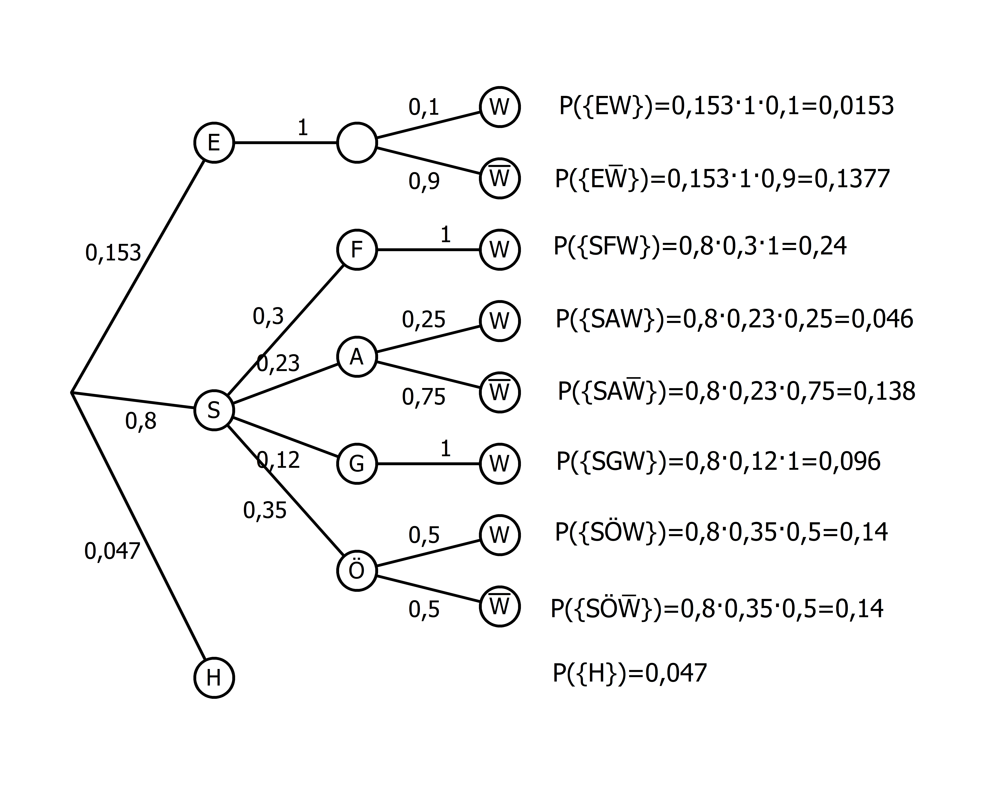
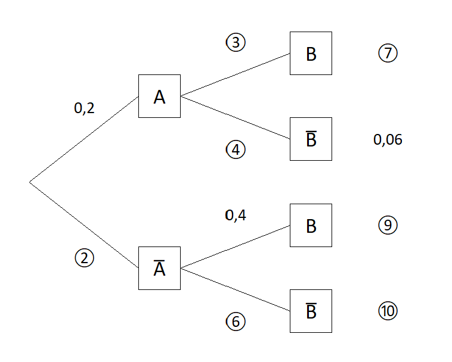

### Einführung

Wenn mehrere Zufallsexperimente nacheinander durchgeführt werden, sprechen wir von einem mehrstufigen Zufallsexperiment. Zur übersichtlichen Darstellung nutzen wir häufig Baumdiagramme. Für jede Stufe des Zufallsexperiments werden die Ergebnisse des einzelnen Zufallsexperiments als Knotenpunkte dargestellt. Die Stufen werden dann durch Pfade miteinander verbunden. Ein Ergebnis des mehrstufigen Zufallsexperiment entspricht dann einem vollständigen Pfad im Baumdiagramm. An den einzelnen Pfaden stehen die entsprechenden Wahrscheinlichkeiten. Es gibt zwei wichtige Regeln:

* **Pfadmultiplikationsregel:** Die Wahrscheinlichkeit eines Ergebnisses ist das Produkt der Wahrscheinlichkeiten entlang des entsprechenden Pfades.
* **Pfadadditionsregel:** Die Wahrscheinlichkeit eines Ereignisses ist die Summe der Wahrscheinlichkeiten der Ergebnisse, die zu diesem Ereignis führen.

Da generell die Summe aller Wahrscheinlichkeiten eines Zufallsexperiments immer gleich 1 ist, ist auch Summe der Wahrscheinlichkeiten aller Pfade, die von einem Knotenpunkt starten, gleich 1. Ebenso ist auch die Summe der Endwahrscheinlichkeiten gleich 1.

##### Beispiel: Zweimaliger Münzwurf

Kopf ($K$) und Zahl ($Z$) treten bei einem einmaligen Wurf beide mit einer Wahrscheinlichkeit von 50&nbsp;\% auf. Daraus ergibt sich folgendes Baumdiagramm:

Nach der Pfadmultiplikationsregel haben wir jede Endwahrscheinlichkeit mit $0{,}5\cdot 0{,}5=0{,}25$ berechnet.

Betrachten wir z.B. das Ereignis $E$: "Es wird zweimal das Gleiche geworfen.", so ist $E=\\{KK, ZZ\\}$, und nach der Pfadadditionsregel folgt nun
\begin{align*}
P(E)&=P(\\{KK\\})+P(\\{ZZ\\})\\\\
&=0{,}25+0{,}25\\\\
&=0{,}5.
\end{align*}

##### Beispiel: Jugendliche auf dem Weg zur Schule

Baumdiagramme eignen sich vor allem dazu, kompliziertere Zufallsexperimente zu veranschaulichen:

Es sei bekannt, dass 4,7&nbsp;\% aller Jugendlichen aus unterschiedlichen Gründen nicht zur Schule kommen und zu Hause bleiben ($H$). Vier Fünftel kommen selbstständig ($S$) zur Schule, die übrigen werden von ihren Eltern ($E$) gebracht. Von denjenigen, die selbstständig zur Schule kommen, nutzen 30&nbsp;\% das Fahrrad ($F$), 23&nbsp;\% das Auto ($A$), 12&nbsp;\% gehen zu Fuß ($G$) und die restlichen Schülerinnen und Schüler benutzen den öffentlichen Personennahverkehr (Ö).
Alle Jugendlichen, die den Großteil ihres Schulwegs an der frischen Luft verbringen, sind in der ersten Unterrichtsstunde wach ($W$). Bei den mit dem Auto gebrachten Jugendlichen ist es lediglich ein Viertel, bei den Nutzern des öffentlichen Personennahverkehrs immerhin noch die Hälfte.
Von den Jugendlichen, die von ihren Eltern zur Schule gebracht werden, ist nur jeder 10. wach.

Das entsprechende Baumdiagramm lautet:
 <figure>
  
</figure>
Hier haben wir für jede Endwahrscheinlichkeit die Pfadmultiplikationsregel angewendet.

Betrachten wir z.B. das Ereignis $E$: "Ein Jugendlicher in der Schule ist in der ersten Stunde müde.", so ist $E=\\{E\overline{W}, SA\overline{W},SÖ\overline{W}\\}$, und nach der Pfadadditionsregel folgt nun
\begin{align*}
P(E)&=P(\\{E\overline{W}\\})+P(\\{SA\overline{W}\\})+P(\\{SÖ\overline{W}\\})\\\\
&=0{,}1377+0{,}138+0{,}14\\\\
&=0{,}4157.
\end{align*}

<!--#### Achtung bei Prozentzahlen
Verwenden wir für die Pfadwahrscheinlichkeiten die Prozentschreibweise, so müssen wir darauf achten, die Prozentzahlen korrekt zu multiplizieren. Im Fall eines zweimaligen Münzwurfs ohne Beachtung der Reihenfolge gilt ja bekanntlich auf jedem Pfad $0,5\cdot 0,5=0,25$. Wir erinnern daran, dass aber $50\\%\cdot 50\\% \neq 2500\\%$ ist.-->

### Mehrstufige Zufallsexperimente mit zwei Ereignissen

Häufig liegt eine Situation vor, in der zwei Ereignisse $A$ und $B$ und deren Gegenereignisse auftreten. Zum Beispiel:

* $A$: Eine Person putzt sich regelmäßig die Zähne.
* $B$: Eine Person hat gesunde Zähne.

Das Baumdiagramm habe die Gestalt

Hinweise:

* Die Ergebnisemenge ist $S=\\{AB, A\overline{B}, \overline{A}B, \overline{A}\overline{B}\\}$.
* Es gilt $A=\\{AB, A\overline{B}\\}$ und $B=\\{AB, \overline{A}B\\}$.
* Auf der ersten Stufe stehen die Wahrscheinlichkeiten von $A$ und $\overline{A}$: $P(A)=0{,}5$ und $P(\overline{A})=0{,}5$.
* Auf der zweiten Stufe stehen die Wahrscheinlichkeiten von $B$ und $\overline{B}$ **in Abhängigkeit** davon, ob $A$ eingetreten ist oder nicht (diese Wahrscheinlichkeiten sind im Allgemeinen nicht $P(B)$ und $P(\overline{B})$).
* Da $B=\\{AB, \overline{A}B\\}$ haben wir $P(B)=0{,}2+0{,}05=0{,}25$. Die Wahrscheinlichkeit, dass eine Person gesunde Zähne hat, beträgt also 25&nbsp;\%.
* "$\cap$-Ereignisse": Wegen $A\cap B=\\{AB\\}$ etc. entspricht jeder Pfad genau dem entsprechenden "$\cap$-Ereignis". Dann folgt $P(A\cap B)=0{,}2$. Die Wahrscheinlichkeit, dass eine Person sich regelmäßig die Zähne putzt und gesunde Zähne hat, beträgt also 20&nbsp;\%.
* "$\cup$-Ereignisse": Wegen $\overline{A}\cup B=\\{AB, \overline{A}B, \overline{A}\overline{B}\\}$ etc. gehören zu jedem "$\cup$-Ereignis" immer genau drei Pfade. Dann folgt
\begin{align*}
P(\overline{A}\cup B)&=P(\\{AB\\}) + P(\\{\overline{A}B\\})  + P(\\{\overline{A}\overline{B}\\})\\\\
&=0{,}2+0,05+0{,}45\\\\
&=0{,}7.
\end{align*}
Die Wahrscheinlichkeit, dass eine Person sich nicht regelmäßig die Zähne putzt oder gesunde Zähne hat, beträgt also 70&nbsp;\%.

##### Übung: Baumdiagramm interpretieren

### Baumdiagramme vervollständigen

Häufig stehen wir vor der Aufgabe, ein unvollständiges Baumdiagramm zu vervollständigen. Dazu verwenden wir, dass die Summe der Wahrscheinlichkeiten der Pfade, die von einem Knotenpunkt starten, gleich 1 ist. Außerdem wenden wir die Pfadregeln geschickt an.

##### Beispiel 1

Sind alle Pfadwahrscheinlichkeiten gegeben – gegebenenfalls durch Berechnung von Gegenwahrscheinlichkeiten –, so lässt sich das Baumdiagramm wie [Beispiel: Jugendliche auf dem Weg zur Schule](#beispiel-jugendliche-auf-dem-weg-zur-schule) vervollständigen.

##### Übung: Baumdiagramm vervollständigen 1

##### Beispiel 2

Gegeben ist das folgende Baumdiagramm:
 <figure>
  
</figure>
Die Wahrscheinlichkeit 4 wird mit $x$ bezeichnet und kann wie folgt berechnet werden $0{,}2\cdot x = 0{,}06$ $\Rightarrow$ $x=0{,}3$. Dann kann sukzessive das Baumdiagramm vervollständigt werden.

##### Übung: Baumdiagramm vervollständigen 2

##### Beispiel 3

Gegeben ist das folgende Baumdiagramm:
 <figure>
  
</figure>
Die Wahrscheinlichkeit 2 wird mit $x$ bezeichnet und kann wie folgt berechnet werden $ x = 0{,}28+0{,}12=0{,}4$. Dann kann sukzessive das Baumdiagramm vervollständigt werden.

##### Übung: Baumdiagramm vervollständigen 3

<!--### Urnenmodelle
Ein wichtiges Beipsiel für mehrstufige Zufallsexperimente sind das Ziehen von Kugeln aus einer Urne. Hier müssen wir unterscheiden, ob Kugeln zurückgegelgt werden oder nicht.

#### Beispiel: Ziehen mit Zurücklegen
In einer Urne

und dann ein alltägliches zufallsexpeirment, das als urnenmodell interpretiert werden kann

-->