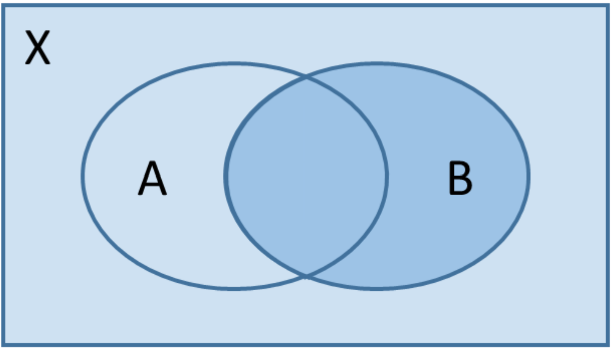
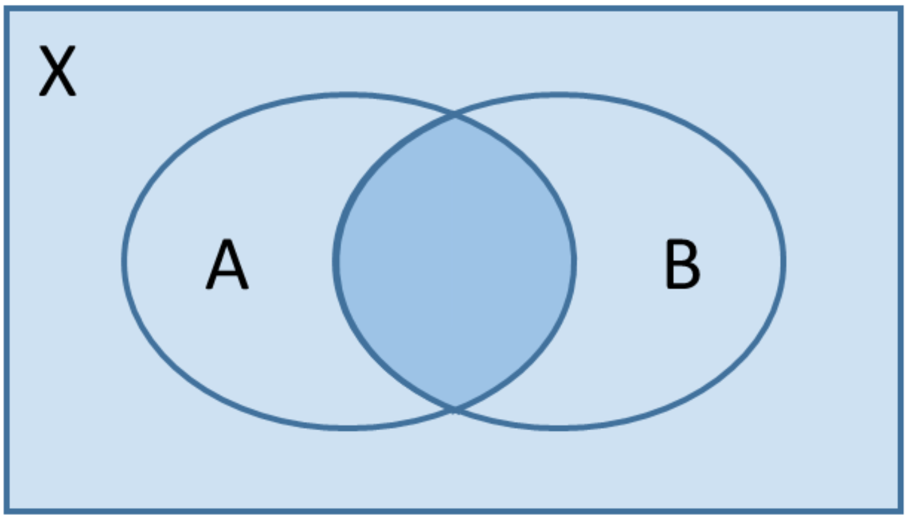
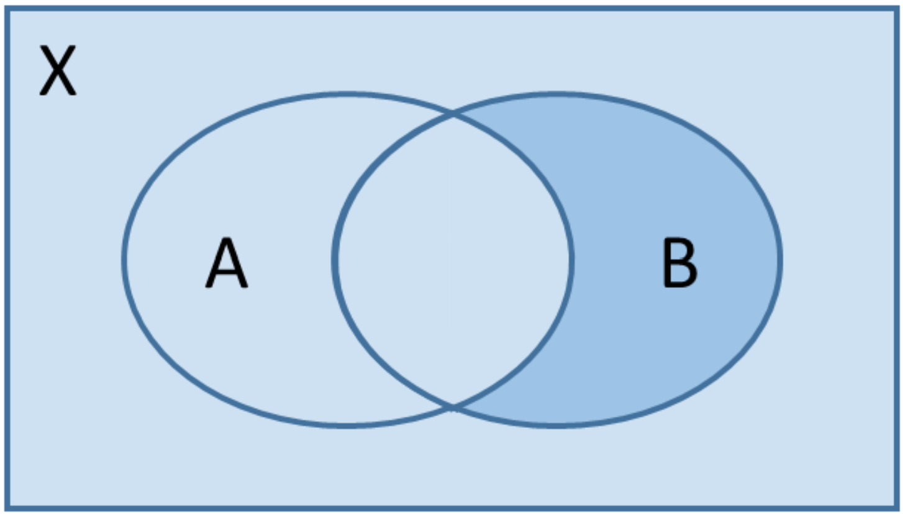
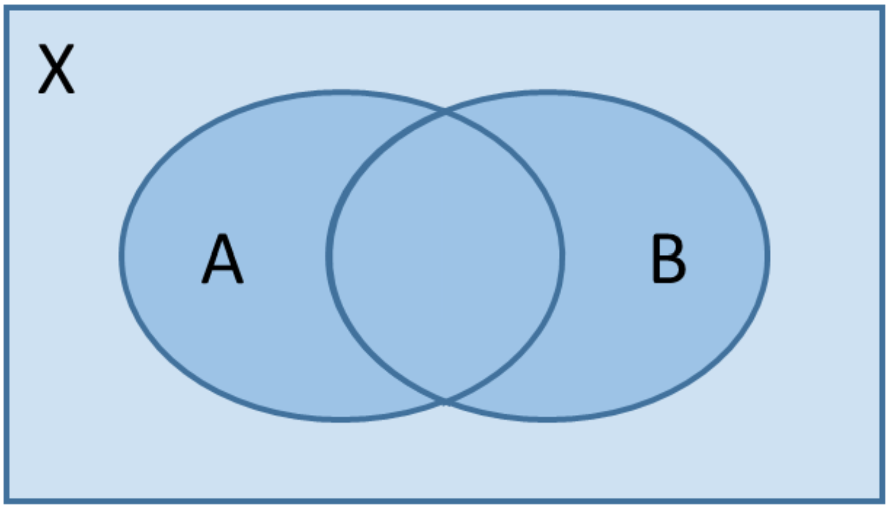
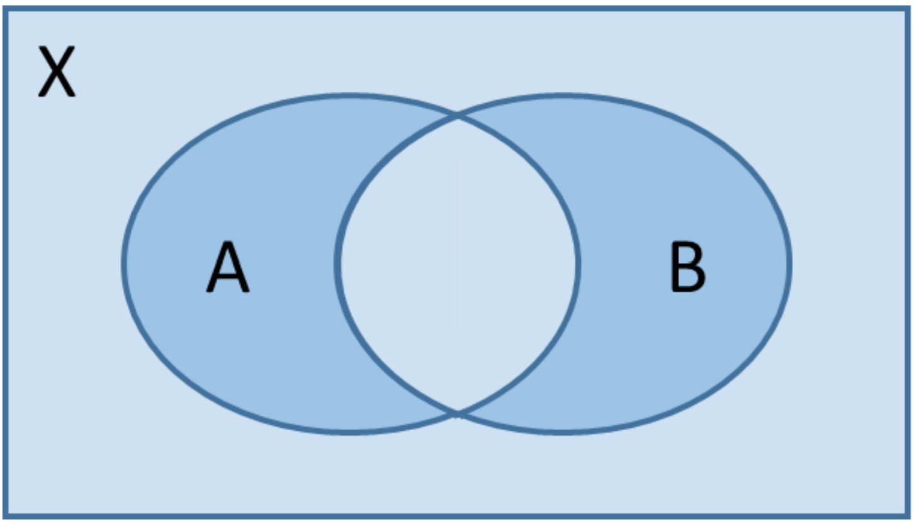

## Mengen

In der Stochastik beschäftigen wir mit der Berechnung von Wahrscheinlichkeiten. Um diese präzise und eindeutig zu beschreiben, verwenden wir die Sprache der Mengenlehre.

### Definition
Eine Menge ist eine Zusammenfassung von einzelnen Elementen.

### Beispiele

* Die Menge der besten Schulfächer: $ S=\\{Mathe;Physik\\} $
* Die Menge der natürlichen Zahlen: $ N=\\{1;2;3;…\\} $
* Die Menge der beliebtesten Fußballmannschaften: $ F=\\{\text{FC Bayern München}\\} $
* Die Menge der Würfelergebnisse: $ W=\\{1;2;3;4;5;6\\} $
* Die Menge der Ergebnisse eines Münzwurfs: $ M=\\{K;Z\\} $

### Grundbegriffe

* Die Elemente einer Menge werden häufig geeignet abgekürzt.  
* Die Elemente einer Menge werden immer in geschweiften Klammern $\\{…\\}$ angegeben.  
* Die leere Menge enthält keine Elemente und wird mit $\emptyset$ bezeichnet.  
* Liegen alle Elemente einer Menge $A$ auch in einer Menge $X$, so ist $A$ eine Teilmenge von $X$. Wir schreiben auch $A \subset X$.  
* Beispiel: Die Menge $X = \\{1;3;4;6;8\\}$ hat die Teilmenge $A = \\{3;6\\}$.  
* Beispiel: Die Menge einer Spielgruppe von Kindern ist $X = \\{\text{Tobias}; \text{Jessica}; \text{Achmed}; \text{Lydia}\\}$. Dann ist die Teilmenge der Mädchen $A = \\{\text{Jessica}; \text{Lydia}\\}$.  
* Ist $A$ eine Teilmenge von $X$, so bilden alle Elemente von $X$, die nicht in $A$ liegen, das Komplement von $A$. Das Komplement von $A$ wird mit $\overline{A}$ bezeichnet.  
* Beispiel: Für $X = \\{1;3;4;6;8\\}$ und der Teilmenge $A = \\{3;6\\}$ ist das Komplement $\overline{A} = \\{1;4;8\\}$.  
* Beispiel: Für $X = \\{\text{Tobias}; \text{Jessica}; \text{Achmed}; \text{Lydia}\\}$ und der Teilmenge der Mädchen $A = \\{\text{Jessica}; \text{Lydia}\\}$ ist das Komplement die Teilmenge der Jungen $\overline{A} = \\{\text{Tobias};\text{Achmed}\\}$.  

### Exkurs: Das Russellsche Paradoxon

Der Mengenbegriff erscheint zunächst klar und einfach: Eine Menge ist eine Zusammenfassung von verschiedenen Objekten. Doch wenn wir genauer hinschauen, können Widersprüche auftreten.
Ein bekanntes Beispiel ist das Russellsche Paradoxon:

Wir betrachten die Menge $M$, die alle Mengen enthält, die sich nicht selbst enthalten.
Nun stellen wir die Frage: Enthält $M$ sich selbst?
* Wenn ja, dann dürfte sie sich nicht enthalten (denn sie enthält ja nur Mengen, die sich nicht selbst enthalten).
* Wenn nein, dann müsste sie sich enthalten (denn sie erfüllt ja die Bedingung, sich nicht selbst zu enthalten).

Beides führt zu einem Widerspruch.
Dieses Paradoxon zeigt, dass der naive Mengenbegriff überarbeitet werden muss. Deshalb arbeiten Mathematiker heute mit exakteren, axiomatischen Grundlagen der Mengenlehre.

## Mengeoperationen

Sind $A$ und $B$ Teilmengen einer Menge $X$, so entstehen durch Vereinigungen, Durchschnitte und Komplemente neue Teilmengen.

### Beispiele

Es sei $ X=\\{1;2;3;4;5;6\\} $.

| Textuelle Beschreibung                                   | Symbol        | Operation                  | Mengenschreibweise             |
|----------------------------------------------------------|---------------|-----------------------------|--------------------------------|
| Die Zahl ist durch 2 teilbar.                            | $A$           |                             | $\\{2;4;6\\}$                     |
| Die Zahl ist durch 3 teilbar.                            | $B$           |                             | $\\{3;6\\}$                       |
| Die Zahl ist durch 2 oder 3 teilbar.                     | $A \cup B$    | Vereinigung von $A$ und $B$ | $\\{2;3;4;6\\}$                   |
| Die Zahl ist durch 2 und 3 teilbar.                      | $A \cap B$    | Durchschnitt von $A$ und $B$| $\\{6\\}$                         |
| Die Zahl ist **nicht** durch 2 teilbar.                  | $\overline{A}$| Komplement von $A$         | $\\{1;3;5\\}$                     |
| Die Zahl ist **nicht** durch 3 teilbar.                  | $\overline{B}$| Komplement von $B$         | $\\{1;2;4;5\\}$                   |

Elemente werden nicht dopellt aufgeführt. Für die Vereinigung von $A=\\{2;4;6\\}$ und $B=\\{3;6\\}$ schreiben wir $\\{2;3;4;6\\}$ und nicht $\\{2;3;4;6;6\\}$ (obwohl es formal nicht verkehrt wäre).

### Rechenregeln

Es seien $A$ und $B$ Teilmengen einer Menge $X$.

| Aussage                                 | Bedeutung                                                                 |
|-----------------------------------------|---------------------------------------------------------------------------|
| $A \cap \overline{A} = \emptyset$       | Es gibt kein Element, das in $A$ liegt und in $\overline{A}$.             |
| $A \cup \overline{A} = X$               | Jedes Element liegt in $A$ oder in $\overline{A}$.                        |
| $\overline{\overline{A}} = A$           | Doppelte Verneinung.                                                     |
| $A = (A \cap B) \cup (A \cap \overline{B})$ | $A$ wird zerlegt in einen Teil, der auch in $B$ liegt, und einen Teil, der in $\overline{B}$ liegt. |
| $\overline{A} \cup \overline{B} = \overline{A \cap B}$  | Gesetz von de Morgan                                                     |
| $\overline{A} \cap \overline{B} = \overline{A \cup B}$  | Gesetz von de Morgan                                                     |

## Zufallsexperimente

In der Stochastik treffen wir Aussagen über (vermeintlich) zufällige Ausgänge von Vorgängen aus der alltäglichen Welt.

### Definitionen

* Ein **Zufallsexperiment** ist ein Vorgang, der unter genau festgelegten Bedingungen durchgeführt wird und einen (vermeintlich) zufälligen Ausgang besitzt.
* Die möglichen Ausgänge eines Zufallsexperiments werden **Ergebnisse** des Zufallsexperiments genannt.
* Die einzelnen Ergebnisse werden zu der **Ergebnismenge** zusammengefasst. Die Ergebnismenge wird häufig mit $S$ oder $\Omega$ (lies: Omega) bezeichnet.
* Ein **Ereignis** besteht aus mehreren Ergebnissen. Ereignisse sind also Teilmengen des Ergebnisraums. Ein Ereignis $A$ tritt ein, falls der Ausgang des Zufallsexperiments ein Ergebnis aus $A$ ist.
* Ergebnisse werden auch **Elementarereignisse** genannt.
* Das **Gegenereignis** eines Ereignisses $A$ wird mit $\overline{A}$ bezeichnet und enthält alle Ergebnisse, die nicht in $A$ liegen. 
* Das **sichere Ereignis** ist die gesamte Ergebnismenge, es tritt immer ein.
* Das **unmögliche Ereignis** ist die leere Menge, es tritt nie ein.

### Beispiele

#### EINMALIGER WÜRFELWURF

* Ergebnisse: $\\{1\\}, \\{2\\}, \\{3\\}, \\{4\\}, \\{5\\}, \\{6\\}$
* Ergebnismenge: $S = \\{1; 2; 3; 4; 5; 6\\}$
* (z. B.) Ereignis $A$: Es wird eine Zahl größer als 4 geworfen. $\Rightarrow A = \\{5; 6\\}$
* Gegenereignis $\overline{A}$: Es wird eine Zahl kleiner als 5 geworfen. $\Rightarrow\overline{A} = \\{1; 2; 3; 4\\}$

#### ZWEIMALIGER MÜNZWURF MIT BEACHTUNG DER REIHENFOLGE

* Ergebnisse: $\\{KK\\}, \\{KZ\\}, \\{ZK\\}, \\{ZZ\\}$
* Ergebnismenge: $S = \\{KK; KZ; ZK; ZZ\\}$
* (z. B.) Ereignis $B$: Es wird das Gleiche geworfen. $\Rightarrow B = \\{KK; ZZ\\}$
* Gegenereignis $\overline{B}$: Es wird etwas Unterschiedliches geworfen.  $\Rightarrow\overline{B} = \\{KZ; ZK\\}$

#### ZWEIMALIGER MÜNZWURF OHNE BEACHTUNG DER REIHENFOLGE

* Ergebnisse: $\\{KK\\}, \\{KZ\\}, \\{ZZ\\}$ (Hierbei wird nicht zwischen $KZ$ ud $ZK$ unterschieden.)
* Ergebnismenge: $S = \\{KK; KZ; ZZ\\}$
* (z. B.) Ereignis $C$: Es wird mindestens einmal Kopf geworfen. $\Rightarrow$ $C = \\{KK; KZ\\}$
* Gegenereignis $\overline{C}$: Es wird niemals Kopf geworfen. $\Rightarrow$ $\overline{C} = \\{ZZ\\}$

## WAHRSCHEINLICHKEITEN

Eine Wahrscheinlichkeitsverteilung $P$ eines Zufallsexperiments, ordnet jedem Ereignis des Zufallsexperiments eine Zahl zwischen 0 und 1 zu.

### BEISPIELE

#### EINMALIGER WÜRFELWURF

* $P(\\{1\\}) = \frac{1}{6},\   P(\\{2\\}) = \frac{1}{6},\   P(\\{3\\}) = \frac{1}{6},\   P(\\{4\\}) = \frac{1}{6},\   P(\\{5\\}) = \frac{1}{6},\   P(\\{6\\}) = \frac{1}{6}$
* $A = \\{5; 6\\}   \Rightarrow   P(A) = \frac{2}{6} = \frac{1}{3}$
* $\overline{A} = \\{1; 2; 3; 4\\}   \Rightarrow   P(\overline{A}) = \frac{4}{6} = \frac{2}{3}$

#### ZWEIMALIGER MÜNZWURF MIT BEACHTUNG DER REIHENFOLGE

* $P(\\{KK\\}) = 0{,}25,\   P(\\{KZ\\}) = 0{,}25,\   P(\\{ZK\\}) = 0{,}25,\   P(\\{ZZ\\}) = 0{,}25$
* $B = \\{KK; ZZ\\}  \Rightarrow  P(B) = 0{,}5$
* $\overline{B} = \\{KZ; ZK\\}  \Rightarrow  P(\overline{B}) = 0{,}5$

#### ZWEIMALIGER MÜNZWURF OHNE BEACHTUNG DER REIHENFOLGE

* $P(\\{KK\\}) = 0{,}25,\   P(\\{KZ\\}) = 0{,}5,\   P(\\{ZZ\\}) = 0{,}25$
* $C = \\{KK; KZ\\}   \Rightarrow   P(C) = 0{,}75$
* $\overline{C} = \\{ZZ\\}   \Rightarrow   P(\overline{C}) = 0{,}25$

### WAHRSCHEINLICHKEITEN – EINFACHE BERECHNUNGSMETHODEN

In einfachen Alltagssituationen funktioniert unser intuitiver Umgang mit Wahrscheinlichkeiten oft gut, und wir können mit einfachen Methoden die Wahrscheinlichkeiten berechnen.

#### RELATIVE HÄUFIGKEITEN

Relative Häufigkeiten (Aussagen über die Vergangenheit) können als Wahrscheinlichkeiten (Aussagen über die Zukunft) interpretiert werden.

#### BEISPIEL 1

Aus persönlichen Beobachtungen sei bekannt, dass 50&nbsp;\% aller Kinder am liebsten Pizza essen, 30&nbsp;\% Pommes und 20&nbsp;\% Nudeln mit Ketchup. Dann ist die Wahrscheinlichkeit, dass ein zufällig ausgewähltes Kind am liebsten Pommes isst, 30&nbsp;\%.

#### BEISPIEL 2

In einer Klausur spicken 2 von 20 Schülern. Dann ist die Wahrscheinlichkeit, dass ein zufällig ausgewählter Schüler spickt, $\frac{2}{20}$ oder 10&nbsp;\%.

### LAPLACE-EXPERIMENT

Ein Laplace-Experiment ist ein Zufallsexperiment, bei dem alle Ergebnisse die gleiche Wahrscheinlichkeit besitzen. Die Wahrscheinlichkeit eines Ereignisses $A$ ist damit:
$$
P(A) = \frac{\text{Anzahl Ergebnisse in } A}{\text{Gesamtanzahl der Ergebnisse}}
$$

#### BEISPIEL 1

Würfelwurf: Es sei $A$ das Ereignis „Es wird eine Primzahl geworfen.“  $\Rightarrow A = \\{2; 3; 5\\} $
Dann gilt:
$$
P(A) = \frac{3}{6} = \frac{1}{2}
$$

#### BEISPIEL 2

Roulette: Es sei $ A $ das Ereignis „Die Kugel landet auf einem roten Feld.“
Dann gilt:
$$
P(A) = \frac{18}{37}
$$
<figure>
  
  <figcaption>KI-generiert mit ChatGPT</figcaption>
</figure>

### Wahrscheinlichkeiten - Weitere Betrachtungen

#### Axiome von Kolmogorov
Eine solide mathematische Fundierung der Stochastik wurde erst in den 1930er Jahren von Andrej Nikolajewitsch Kolmogorov (1903-1987) entwickelt. Kolmogorov formulierte die folgenden Grundsätze (Axiome), aus denen sich dann weitere Rechenregeln folgern lassen.
Betrachtet wird ein Zufallsexperiment mit Ergebnismenge $\Omega$ und Ereignissen $A$ und $B$. Eine Wahrscheinlichkeitsverteilung $P$ ordnet jeder Teilmenge von $\Omega$, also jedem Ereignis, eine reelle Zahl zu, so dass gilt:
* $P(A)\geq 0$
* $P(\Omega)=1$
* $P(A\cup B)=P(A)+P(B)$, falls $A\cap B=\emptyset$,

für alle Teilmenge $A$ und $B$ von $\Omega$.

#### Folgerungen und Hinweise

* $P(\emptyset)=0$
* Alle Wahrscheinlichkeiten liegen immer zwischen einschließlich 0 und einschließlich 1.
* Für die Wahrscheinlichkeit des Gegenereignisses von Ereignis $A$ gilt $P(\overline{A})=1-P(A)$.
Beispiel: Aus $P(A)=0,3$ folgt $P(\overline{A})=1-0,3=0,7$.
* Falls $A\cap B\neq\emptyset$, so ist im Allgemeinen $P(A\cup B)\neq P(A)+P(B)$. Die Wahrscheinlichkeit $P(A\cap B)$ taucht in $P(A\cup B)$ nur einmal, in $P(A)+P(B)$ jedoch zweimal auf. Daher gilt $P(A\cup B)=P(A)+P(B)-P(A\cap B)$ (Satz von Sylvester).
Hieraus folgt, dass wir, wenn drei der vier Wahrscheinlichkeiten $P(A)$, $P(B)$, $P(A\cap B)$ und $P(A\cup B)$ bekannt sind, die vierte berechnen können.
Beispiel: Aus $P(A)=0,3$, $P(B)=0,4$ und $P(A\cap B)=0,2$ folgt $P(A\cup B)=0,3+0,4-0,2=0,5$.
* Ausschließendes Oder: Die Wahrscheinlichkeit für entweder $A$ oder $B$ (aber nicht $A$ und $B$ gleichzeitig) ist $P(A\cup B)- P(A\cap B)=P(A\cap\overline{B})+P(\overline{A}\cap B)$.

#### Venn-Diagramme
Die Mengenoperationen und Axiome von Kolmogorov mit ihren Folgerungen lassen sich anschaulich anhand sogenannter Venn-Diagramme nachvollziehen: Ereignisse können als Teilflächen einer Fläche $X$ interpretiert werden. Die Wahrscheinlichkeiten der Ereignisse entsprechen dann den Inhalten dieser Teilflächen. Der Inhalt der Fläche $X$ ist nach Definition 1. Wir erhalten z.B.:
|$P(B)$|$P(A\cap B)$|$P(\overline{A}\cap B)$|$P(A\cup B)$|$P(A\cup B)-P(A\cap B)$|
|-|-|-|-|-|
|<figure> |<figure>   </figure>|<figure>    </figure>|<figure>    </figure>|<figure>   </figure>|

