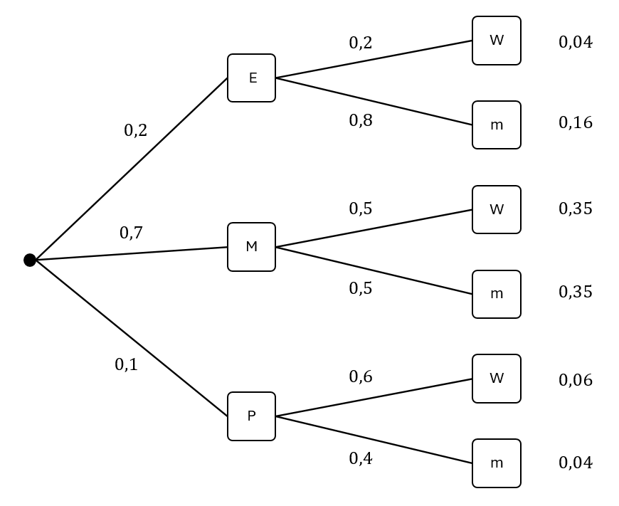
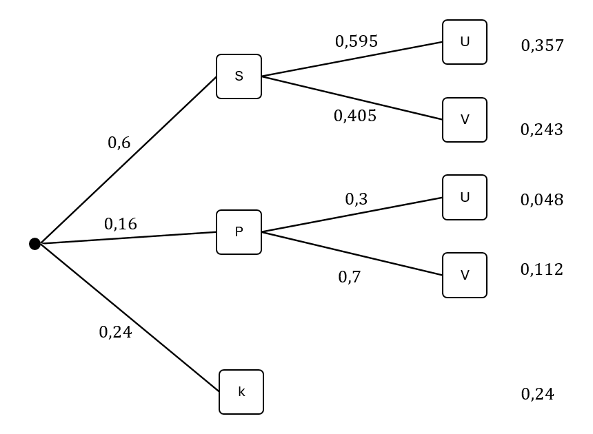

### Einführung

Ergebnisse von Zufallsexperimenten sind im Allgemeinen keine Zahlen, sondern beliebige Elemente (beim Münzwurfe sind die Ergebnisse z.B. "Kopf" und "Zahl"). Von solchen Ergebnissen können Wahrscheinlichkeiten bestimmt werden, aber keine Kennzahlen wie einen Mittelwert (beim Münzwurf ist die Frage "Welches Ergebnis werfe ich im Durchschnitt?" sinnlos). Dazu ist es nötig, dass wir Ergebnissen Zahlen zuordnen.

Eine **Zufallsgröße** $X$ ordnet jedem Ergebnis eines Zufallsexperiment eine reelle Zahl zu. Wir sprechen in der Regel direkt von Werten einer Zufallsgröße $x_1, x_2, \ldots $ und ihren Wahrscheinlichkeiten $P(X=x_1)$, $P(X=x_2)$, $\ldots$. Die Wahrscheinlichkeitsverteilung einer Zufallsgröße stellen wir häufig tabellarisch oder mit Histogrammen dar.

##### Beispiel: Biathlet A

Ein Biathlet A absolviert eine Schießeinheit mit fünf Schüssen auf Zielscheiben. Die Zufallsgröße $X$ beschreibt die Anzahl der Fehlschüsse. Aus langfristigen Beobachtungen ergeben sich die folgenden Wahrscheinlichkeiten für die möglichen Werte von $X$:

| Fehlschüsse $x_i$ | $0$      | $1$      | $2$      | $3$      | $4$      | $5$ |
| ----------------- | -------- | -------- | -------- | -------- | -------- | --- |
| $P(X = x_i)$      | $0{,}03$ | $0{,}33$ | $0{,}57$ | $0{,}03$ | $0{,}04$ | $0$ |

Beispielsweise bedeutet $P(X=2)=0{,}19$, dass die Wahrscheinlichkeit, mit der Biathlet A genau zweimal das Ziel verfehlt, 19&nbsp;\% beträgt. Das zugehörige Histogramm hat folgende Darstellung:

##### Beispiel: Biathlet B

Die Wahrscheinlichkeitsverteilung sowie das Histogramm eines weiteren Biathleten B könnten wie folgt aussehen:

| Fehlschüsse $x_i$ | $0$      | $1$      | $2$      | $3$      | $4$      | $5$      |
| ----------------- | -------- | -------- | -------- | -------- | -------- | -------- |
| $P(X = x_i)$      | $0{,}37$ | $0{,}16$ | $0{,}18$ | $0{,}08$ | $0{,}09$ | $0{,}12$ |

### Kenzahlen

#### Der Erwartungswert

Wie lässt sich nun feststellen, welcher Biathlet der treffsicherere ist? Um dies zu entscheiden, können wir die Werte der Zufallsgröße unter Berücksichtigung ihrer Wahrscheinlichkeiten zusammenfassen. Dazu verwenden wir den **Erwartungswert**. Er gibt uns den Wert, den wir im Mittel erwarten können, wenn ein Zufallsexperiment sehr oft wiederholt wird.

Der Erwartungswert einer (diskreten) Zufallsgröße $X$ ergibt sich aus der Summe der Produkte der einzelnen Werte $x_i$ mit ihren jeweiligen Wahrscheinlichkeiten $P(X = x_i)$:

\begin{align*}
E(X) &= x_1 \cdot P(X = x_1) + x_2 \cdot P(X = x_2) + \ldots + x_n \cdot P(X = x_n) \\\\
&= \sum*{i=1}^{n} x_i \cdot P(X = x_i)
\end{align*}

In der Statistik, in der Wahrscheinlichkeiten häufig als relative Häufigkeiten interpretiert werden, entspricht der Erwartungswert dem **gewichteten arithmetischen Mittel**. Das bedeutet: Häufigere (wahrscheinlichere) Werte fließen stärker in den Mittelwert ein als seltenere.

##### Beispiel: Der Erwartungswert von Biathlet A

\begin{align*}
E(X) &= 0 \cdot 0{,}03 + 1 \cdot 0{,}33 + 2 \cdot 0{,}57 + 3 \cdot 0{,}03 + 4 \cdot 0{,}04 + 5 \cdot 0 \\\\
&= 0 + 0{,}33 + 1{,}14 + 0{,}09 + 0{,}16 + 0 \\\\
&= 1{,}72
\end{align*}

Der Erwartungswert beträgt also $1{,}72$. Das bedeutet: Biathlet A verfehlt im Mittel etwa $1{,}72$-mal das Ziel.

##### Beispiel: Der Erwartungswert von Biathlet B

\begin{align*}
E(X) &= 0 \cdot 0{,}37 + 1 \cdot 0{,}16 + 2 \cdot 0{,}18 + 3 \cdot 0{,}08 + 4 \cdot 0{,}09 + 5 \cdot 0{,}12 \\\\
&= 0 + 0{,}16 + 0{,}36 + 0{,}24 + 0{,}36 + 0{,}60 \\\\
&= 1{,}72
\end{align*}

Der Erwartungswert für Biathlet B beträgt also $1{,}72$. Auch Biathlet B verfehlt im Mittel etwa $1{,}72$-mal das Ziel .

Wären die Erwartungswerte der beiden Biathleten unterschiedlich gewesen, hätten wir eine fundierte Entscheidungsgrundlage gehabt, um zu entscheiden, welcher der treffsicherere Biathlet ist.

##### Musteraufgabe: Bestimmung des Erwartungswerts

##### Übung: Bestimmung des Erwartungswerts

#### Die Standardabweichung

Wie lassen sich die Werte der Biathleten noch unterscheiden? Im Mittel erwarten wir die gleiche Anzahl an Fehlschüssen. Hilfreich könnte es jedoch sein, festzustellen, wie stark die Werte schwanken. Anhand der Histogramme erkennen wir, dass bei Biathlet B die Werte deutlich stärker schwanken: Biathlet A hat fast immer nur 1 oder 2 Fehlschüsse, während Biathlet B eine größere Bandbreite an möglichen Fehlschüssen aufweist.

Wir suchen nun eine Kennzahl, mit der wir genau messen können, wie stark eine Zufallsgröße von ihrem Erwartungswert abweicht. Die grundlegende Idee ist es, die Summe der quadrierten, mit den Wahrscheinlichkeiten gewichteten Abweichungen vom Erwartungswert zu betrachten und anschließend die Wurzel zu ziehen. Diese Kennzahl nennen wir **Standardabweichung** $\sigma(X)$ (lies: Sigma von X):

\begin{align*}
\sigma(X) &= \sqrt{(x_1-E(X))^2 \cdot P(X = x_1) + (x_2-E(X))^2 \cdot P(X = x_2) + \ldots + (x_n-E(X))^2 \cdot P(X = x_n)} \\\\
&= \sqrt{\sum*{i=1}^{n} (x_i - E(X))^2\cdot P(X=x_i)}
\end{align*}

Auch der Ausdruck unter der Wurzel eignet sich, die Schwankungen zu messen. Er wird **Varianz** genannt und mit $\sigma^2$ bezeichnet.

##### Beispiel: Die Standardabweichung von Biathlet A

Der Erwartungswert ist bekanntlich $E(X) = 1{,}72$. Wir berechnen zunächst die Varianz:

\begin{align*}
\sigma^2(X) &= (0 - 1{,}72)^2 \cdot 0{,}03 + (1 - 1{,}72)^2 \cdot 0{,}33 + (2 - 1{,}72)^2 \cdot 0{,}57 \\\\
&\quad + (3 - 1{,}72)^2 \cdot 0{,}03 + (4 - 1{,}72)^2 \cdot 0{,}04 + (5 - 1{,}72)^2 \cdot 0 \\\\
&= (2{,}9584) \cdot 0{,}03 + (0{,}5184) \cdot 0{,}33 + (0{,}0784) \cdot 0{,}57 \\\\
&\quad + (1{,}6384) \cdot 0{,}03 + (5{,}1984) \cdot 0{,}04 + (10{,}7584) \cdot 0 \\\\
&= 0{,}0888 + 0{,}1700 + 0{,}0447 \\\\
&\quad + 0{,}0492 + 0{,}2079 + 0 \\\\
&= 0{,}5606
\end{align*}

Die Varianz beträgt also $0{,}5606$.

Nun ziehen wir die Wurzel, um die Standardabweichung zu erhalten:

$$
\sigma(X) = \sqrt{0{,}5606} \approx 0{,}75
$$

Die Standardabweichung von Biathlet A beträgt also ungefähr $0{,}75$.

##### Beispiel: Die Standardabweichung von Biathlet B

Auch hier beträgt der Erwartungswert $E(X) = 1{,}72$. Wir berechnen zunächst die Varianz:

\begin{align*}
\sigma^2(X_B) &= (0 - 1{,}72)^2 \cdot 0{,}37 + (1 - 1{,}72)^2 \cdot 0{,}16 + (2 - 1{,}72)^2 \cdot 0{,}18 \\\\
&\quad + (3 - 1{,}72)^2 \cdot 0{,}08 + (4 - 1{,}72)^2 \cdot 0{,}09 + (5 - 1{,}72)^2 \cdot 0{,}12 \\\\
&= 2{,}9584 \cdot 0{,}37 + 0{,}5184 \cdot 0{,}16 + 0{,}0784 \cdot 0{,}18 \\\\
&\quad + 1{,}6384 \cdot 0{,}08 + 5{,}1984 \cdot 0{,}09 + 10{,}7584 \cdot 0{,}12 \\\\
&= 1{,}0956 + 0{,}0829 + 0{,}0141 + 0{,}1311 + 0{,}4679 + 1{,}2909 \\\\
&= 3{,}0825
\end{align*}

Nun ziehen wir die Wurzel, um die Standardabweichung zu berechnen:

$$
\sigma(X) = \sqrt{3{,}0825} \approx 1{,}75
$$

Die Standardabweichung von Biathlet B beträgt also ungefähr $1{,}75$. Die Anzahl der Fehlschüsse schwankt hier also stärker um den Erwartungswert als bei Biathlet A.

#### Übung: Bestimmung der Standardabweichung

#### Interpretationen

##### Die Biathleten A und B

Die Erwartungswerte der beiden Biathleten sind gleich: $E(X_A)=1,72$ und $E(X_B)=1,72$. Das bedeutet, dass sie im Mittel die gleiche Anzahl an Fehlschüssen haben.

Die Standardabweichungen entscheiden sich allerdings deutlich: $\sigma(X_A) \approx 0{,}75$ und $\sigma(X_B) \approx 1{,}75$. Eine präzise Interpretation dieser Standardabweichungen ist an dieser Stelle nicht unmittelbar möglich. Vereinfacht gesagt, liegt ein Großteil der Werte in einem Intervall von etwa einer Standardabweichung um den Erwartungswert. Dieses Intervall umfasst also typischerweise die „häufigen“ Werte der Zufallsgröße.

Für Biathlet A gilt:
\begin{align*}
E(X_A) - \sigma(X_A) &\approx 1{,}72 - 0{,}75 = 0{,}97 \\\\
E(X_A) + \sigma(X_A) &\approx 1{,}72 + 0{,}75 = 2{,}47
\end{align*}

Das bedeutet, dass die Anzahl der Fehlschüsse bei A meistens zwischen 1 und 2 liegt.

Für Biathlet B gilt:
\begin{align*}
E(X_B) - \sigma(X_B) &\approx 1{,}72 - 1{,}75 = -0{,}03 \\\\
E(X_B) + \sigma(X_B) &\approx 1{,}72 + 1{,}75 = 3{,}47
\end{align*}

Biathlet B hat also häufig 0 bis 3 Fehlschüsse.

Welcher Biathlet ist nun der "Bessere"? Diese Frage lässt sich nicht pauschal beantworten. Zunächst haben wir festgestellt, dass die Erwartungswerte der beiden Biathleten gleich sind, was bedeutet, dass sie im Mittel gleich viele Fehlschüsse erzielen. Allerdings zeigt die Standardabweichung, dass die Fehlschüsse bei Biathlet B stärker schwanken als bei Biathlet A.

Die Entscheidung, welcher Biathlet der "Bessere" ist, hängt letztlich von der Präferenz des Entscheiders ab. Biathlet A ist konstanter, während Biathlet B mehr Schwankungen aufweist. Dies könnte in verschiedenen Kontexten unterschiedliche Bedeutung haben:

- In einem Qualifikationslauf, bei dem es vor allem darauf ankommt, eine bestimmte Zeit zu erreichen oder eine konstante Leistung zu zeigen, könnte Biathlet A bevorzugt werden, da er weniger Risiken eingeht und seine Fehlschüsse stabiler sind.
- In einem Finalrennen, bei dem der erste Platz das Ziel ist und möglicherweise ein höheres Risiko erforderlich ist, könnte Biathlet B die bessere Wahl sein. Wenn die Schwankungen in die richtige Richtung ausschlagen, ist der erste Platz wahrscheinlicher.

Letztlich hängt die Entscheidung davon ab, ob der Fokus auf Konstanz oder auf der Fähigkeit liegt, auch in schwierigen Situationen hohe Leistungen zu bringen.

##### Allgemeine Situationen

In vielen Anwendungssituationen ist eine kleine Standardabweichung vorteilhaft, weil sie weniger Unsicherheit bedeutet. So ist es für die meisten Menschen vorteilhaft, monatlich in etwa die gleichen Einnahmen und Ausgaben zu haben, da sie dadurch mehr Planungssicherheit gewinnen. Das Gleiche gilt für Unternehmen oder Regierungen, die ebenfalls von stabilen Einnahmen und Ausgaben profitieren, um langfristig erfolgreich agieren zu können.

<!--
#### Exkurs: Die Bedeutung der Standardabweichung

Dazu wechseln wir einmal die Perspektive: Statistik und ohne Gewichtung mit Wahrscheinlichkeiten. Dann haben wir folgendes Setting:
Beobachtungswerte $x_1, x_2, \ldots x_n$: Dem Erwartungswert entpsriht hier das airthnetische Mittel. (An dieser Stelle könnte man im übrigen grundsätzlich fragen, ob das arithmetische Mittel ok ist)
Frage: Wie messen wir die Abweichung vom airthmwtschen Mittel. Wir betrachten folgende 3 Möglchkeiten

1. absolute Abweichung
2. quadraitsche Abweichung
3. Abweochugnen höheren ORdnung

...
1. wird durch den MEdian minimeirt
2. Nur die quarstische Abweichung wurd durch das arithmwitsche Mittel minimiert.
3. andere KEnnahlen

WEnn wir also wollen, das unser abweichungsmaß beim arithmetischen mittel den kleinsten wert annimmt, so landen wir bei der standaabweichung. Historisch gibt es einen spektakulären Efolgt: Gauss hat mit Hilfe der quadratischen Abweichugnen einen Planten entdeckt.

Absolute Abweichung
Wir betrachten die Standardabweichng zunächst ohne den Erwartungswert als eine Funktion in Abhängigkeit von $x$
$$
f(x)=\sqrt{\frac{1}{n} \sum_{i=1}^{n} (x_i - x)^2}
$$
Durch eine REchnung lässt sich zeigen, dass $f$ für
-->

### Vervollständigung von Wahrscheinlichkeitsverteilungen

Häufig stehen wir vor der Aufgabe, eine teilweise gegebene Verteilung zu vervollständigen.

#### Eine fehlende Wahrscheinlichkeit

Die Wahrscheinlichkeitsverteilung lautet:

| $x_i$        | $-4$     | $-2$     | $-1$ | $2$      | $5$      |
| ------------ | -------- | -------- | ---- | -------- | -------- |
| $P(X = x_i)$ | $0{,}07$ | $0{,}06$ |      | $0{,}41$ | $0{,}44$ |

Hier kann leicht der fehlende Wert berechnet werden, da die Summe der Wahrscheinlichkeiten 1 ergeben muss. Daher ist

\begin{align*}
P(X = -1) & = 1 - (0,07 + 0,06 + 0,41 + 0,44) \\\\
& = 1 - 0,98 \\\\
& = 0,02
\end{align*}

#### Übung: Fehlende Wahrscheinlichkeit

#### Ein fehlender Wert

Die Wahrscheinlichkeitsverteilung lautet:

| $x_i$        | $-5$     | $x$      | $0$      | $1$      | $4$     |
| ------------ | -------- | -------- | -------- | -------- | ------- |
| $P(X = x_i)$ | $0{,}05$ | $0{,}39$ | $0{,}37$ | $0{,}09$ | $0{,}1$ |

Außerdem ist bekannt, dass $E(X)=-0{,}93$.

Um $x$ zu berechnen, verwenden wir die Definition des Erwartungswerts:

$$
-0{,}93 = (-5 \cdot 0{,}05) + (x \cdot 0{,}39) + (0\cdot 0{,}37)  + (1 \cdot 0{,}09) + (4 \cdot 0{,}10)
$$

Diese Gleichung können wir nach $x$ auflösen
\begin{align*}
-0{,}93 & = -0{,}25 + 0{,}39x + 0{,}09 + 0{,}40\\\\
-0{,}93 & = 0{,}39x + 0{,}24 \quad |-0{,}24\\\\
-1{,}17 & =0{,}39x \quad |:0{,}39\\\\
x&=-3
\end{align*}

#### Übung: Fehlender Wert

#### Zwei fehlende Wahrscheinlichkeiten

Die Wahrscheinlichkeitsverteilung lautet:

| $x_i$        | $-4$     | $-2$     | $-1$ | $1$      | $4$ |
| ------------ | -------- | -------- | ---- | -------- | --- |
| $P(X = x_i)$ | $0{,}15$ | $0{,}27$ | $x$  | $0{,}08$ | $y$ |

Außerdem ist bekannt, dass $E(X)=0{,}29$

Da wir zwei Unbekannte haben, sind auch zwei Gleichungen nötig, um sie zu bestimmen:

1. Die Summe der Wahrscheinlichkeiten muss 1 ergeben:
   $0{,}15 + 0{,}27 + x + 0{,}08 +y = 1$
2. Der gegebene Erwartungswert:
   $0{,}29 = (-4 \cdot 0{,}15) + (-2 \cdot 0{,}27) + (-1 \cdot x) + (1 \cdot 0{,}08) + (4 \cdot y)$

Die Gleichungen lassen sich vereinfachen:

1. $x + y = 0{,}5$
2. $- x + 4y = 1{,}35$

Nun gibt es verschiedene Techniken, dieses Gleichungssystem zu lösen. Wir lösen zunächst nach $x$ auf:

1. $x = 0{,}5 - y $
2. $x = 4y - 1{,}35 $

und setzen gleich: $0{,}5 -y = 4y - 1{,}35$. Es folgt $1{,}85 = 5y$ und so $y=0{,}37$. Nun folgt $x=0{,}5 - 0{,}37 = 0{,}13$.

#### Übung: Fehlende Wahrscheinlichkeiten

#### Weitere Beispiele

##### Elektronikfachmarkt

In [diesem Beispiel](skript.html?thema=Mehrstufige%20Zufallsexperimente#elektronikfachmarkt) wurden für eine statistische Untersuchung in einem großen Elektronikfachmarkt Aufzeichnungen über die Verkäufe von Laptops mit Windows- bzw. macOS-Betriebssystem geführt. Zusätzlich wurden drei Gerätekategorien erfasst: Einsteigergeräte (E), Mittelklassegeräte (M) und Premiumgeräte (P).

Der Sachverhalt ist in folgendem Baumdiagramm dargestellt:

 <figure>
  
</figure>

Der Gewinn bei Windows-Geräten beträgt unabhängig von der Gerätekategorie 180&nbsp;€ pro Stück. Bei macOS-Geräten beläuft sich der Gewinn auf 130&nbsp;€ für Einsteigergeräte, 210&nbsp;€ für Mittelklassegeräte und 290 € für Premiumgeräte.

Wie lautet die Wahrscheinlichkeitsverteilung der Zufallsgröße, die den Gewinn pro Laptop angibt?

Zunächst berechnen wir $P(\\{W\\})=0{,}04+0{,}35+0{,}06=0{,}45$. Wir erhalten:

| $x_i$        | $180$    | $130$    | $210$    | $290$    |
| ------------ | -------- | -------- | -------- | -------- |
| $P(X = x_i)$ | $0{,}45$ | $0{,}16$ | $0{,}35$ | $0{,}04$ |

Wie hoch ist der erwartete Gewinn pro Laptop? Und wie hoch ist der Gesamtgewinn bei 80.000 verkauften Laptops?

 Wir berechnen den Erwartungswert:
\begin{align*}
E(X) &= 180 \cdot 0{,}45 + 130 \cdot 0{,}16 + 210 \cdot 0{,}35 + 290 \cdot 0{,}04 \\\\
&= 81 + 20{,}8 + 73{,}5 + 11{,}6 \\\\
&= 186{,}9.
\end{align*}

Der Gesamtgewinn beträgt dann $186{,}9 \cdot 80.000 = 14.952.000$ €.

##### Lern-Apps

In [diesem Beispiel](skript.html?thema=Mehrstufige%20Zufallsexperimente#lern-apps) wurden 2.000 Schülerinnen und Schülern befragt, welche Versionen von Lern-Apps sie nutzen: Starter-Versionen (S), Pro-Versionen (P) oder keine Lern-Apps (k). Außerdem wurde untersucht, ob sie die Apps zur Unterhaltung (U) oder zur Vorbereitung auf Prüfungen (V) verwenden.

Der Sachverhalt ist in folgendem Baumdiagramm dargestellt:

 <figure>
  
</figure>

Jugendliche, die mit Pro-Versionen von Lern-Apps gezielt für Prüfungen gelernt haben, erreichen in der Abiturprüfung im Durchschnitt 11,3 Punkte. Diejenigen, die mit Starter-Versionen gezielt gelernt haben, erzielen im Mittel 10,4 Punkte, jene, die Lern-Apps zur Unterhaltung nutzen, 9,1 Punkte. Jugendliche ohne Nutzung von Lern-Apps erreichen durchschnittlich 7,3 Punkte.

Wie lautet die Wahrscheinlichkeitsverteilung der Zufallsgröße, die die Punkte in der Abiturprüfung angibt?

Die Wahrscheinlichkeit, dass ein Jugendlicher Lern-Apps nur zur Unterhaltung nutzt beträgt $0{,}357+0{,}048=0{,}405$. Wir erhalten:

| $x_i$        | $11{,}3$  | $10{,}4$  | $9{,}1$   | $7{,}3$  |
| ------------ | --------- | --------- | --------- | -------- |
| $P(X = x_i)$ | $0{,}112$ | $0{,}243$ | $0{,}405$ | $0{,}24$ |

Wie viele Punkte erreichen Jugendliche in der Abiturprüfung im langfristen Mittel?

Wir berechnen den Erwarrtungswert:
\begin{align*}
E(X) &= 11{,}3 \cdot 0{,}112 + 10{,}4 \cdot 0{,}243 + 9{,}1 \cdot 0{,}405 + 7{,}3 \cdot 0{,}24 \\\\
&= 1{,}2656 + 2{,}5272 + 3{,}6855 + 1{,}752 \\\\
&= 9{,}2303.
\end{align*}

